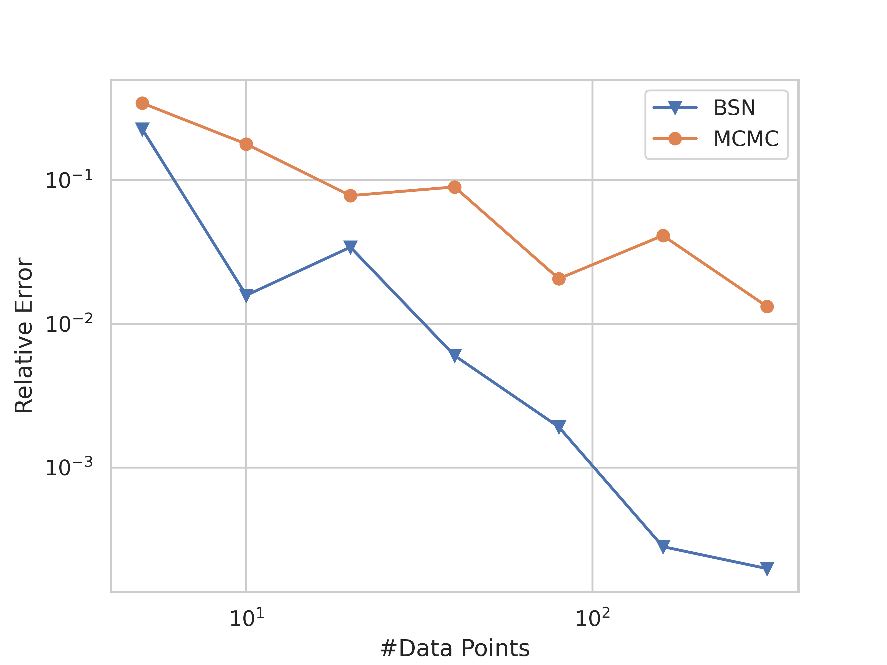

# Bayesian Stein Network

>[!WARNING]  
> This is code is not the code used for the paper but a reimplementation in JAX. The original code was written in PyTorch. The code currently lacks functionality to fully reproduce the experiments in the original paper.

> [!WARNING]  
> The code is lacking fundamental functionality described in the paper. Most importantly, it currently does not apply the Laplace approximation at the end.


This is a reimplementation of the Bayesian Stein Network (BSN) [[1]](#ott2023) in JAX. The BSN is a network architecture that allows to compute integral using a neural network and obtain an uncertainty estimate for the predicted value. 

The original code used for the paper was written in PyTorch. I wanted to test whether some functionality is easier to implement in JAX than in PyTorch. And indeed, computing the gradients inside the Stein-Operator seems to be easier in JAX than in PyTorch thanks to `vmap`.

## Installation
To-Do

## Task

The BSN is used to compute integrals of the form
```math
\Pi[f] = \int_{\mathcal{X}} f(x) \pi(x) dx,
```
where $`\mathcal{X} \in \mathbb{R}^d`$, $`f: \mathcal{X} \rightarrow \mathbb{R}`$ a function, and $`\pi: \mathcal{X} \rightarrow \mathbb{R}^+`$ a probability density function.

Given a standard neural network $`u_{\theta_u}`$, we define the following network architecture:
```math
g_{\theta} = \left(\nabla_x \log \pi(x)\right)^\top u(x) + \nabla_x \cdot u(x) + \theta_0,
```
where $`\theta = \{\theta_u, \theta_0\}`$ are the parameters of the network $`g`$.
To train the network, we use data $`\{x_i, y_i\}_{i=1}^n`$ where $`x_i \sim \pi`$ and $`y_i \sim f(x_i)`$. 

For more details, see the original paper [[1]](#ott2023).


## Experiments
Currently, the implementation only includes the 1-dimensional Genz-family data set. Here is the result of running the experiment on the 1-dimensional continuous Genz data set. Each value is computed as the mean of three runs:




As described in the paper, on a 1-dimensional dataset like this, the Stein-Network might not the best option (for a Bayesian option one could consider Bayesian quadrature with an appropriate kernel). However, the interpolation capabilities of the Stein network already lead to a large advantage over plain Monte-Carlo sampling. Of course, on the Genz data set where both $`f`$ and $`\pi`$ are cheap to evaluate, sampling is the superior option, as we can obtain large data sets quickly. For illustrative purposes we compare Monte-Carlo and the BSN for a fixed number of data points.

To run the experiment yourself, run 
```commandline
python run_experiment.py
```
The parameters can be changed in `run_experiment.py`. Per default, the code uses scipy's L-BFGS-B which does not work with CUDA and does not allow jitting. 

## References
<a name="ott2023"></a> [1] Ott, K., Tiemann, M., Hennig, P. &amp; Briol, F.X. (2023). Bayesian numerical integration with neural networks. <i>Proceedings of the Thirty-Ninth Conference on Uncertainty in Artificial Intelligence</i>, in <i>Proceedings of Machine Learning Research</i> 216:1606-1617 Available from https://proceedings.mlr.press/v216/ott23a.html.

